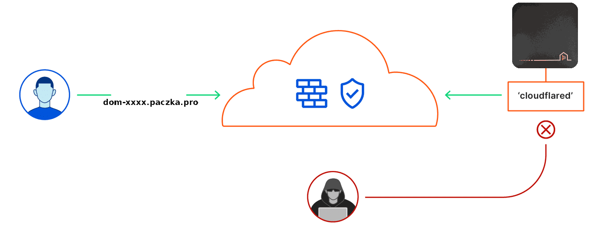

# AIS Cloudflared

View English description | [Go to English description below](#english-description)

Cloudflared łączy Twoją instancję Home Assistant poprzez bezpieczny tunel z wybraną przez Ciebie subdomeną na hoście `paczka.pro`.
Dzięki temu możesz bezpiecznie udostępnić instancję swojego Home Assistant-a w Internecie bez otwierania portów na routerze na adresie `<twoja-subdomena>.paczka.pro`



## Początkowe ustawienia

### Konfiguracja dodatku AIS Cloudflared

W poniższych krokach pokażemy jak utworzyć tunel AIS Cloudflare i udostępnić swoją instancję Home Assistant w Internecie.

1. Skonfiguruj integrację `http` w Home Assistant

   ##### configuration.yaml

   Ponieważ Home Assistant blokuje żądania od serwerów proxy/reverse proxy, trzeba ustowić w swojej instancji, aby zezwoliła na żądania z dodatku Cloudflared. Dodatek działa lokalnie, więc HA musi ufać sieci doker. W tym celu należy dodać następujące linie do pliku `/usr/share/hassio/homeassistant/configuration.yaml`:

   **Notatka**: _Nie ma potrzeby dostosowywania niczego w tych liniach, ponieważ sieci doker jest zawsze taka sama._

   ```yaml
   http:
     use_x_forwarded_for: true
     trusted_proxies:
       - 172.30.33.0/24
   ```

   Pamiętaj o ponownym uruchomieniu Home Assistant po zmianie konfiguracji.

2. Skonfiguruj dodatek AIS Cloudflared w Home Assistant

   ##### TODO

# English description

Cloudflared connects your Home Assistant Instance via a secure tunnel to a
subdomain `<your-subdomain>.paczka.pro` at Cloudflare.
This allows you to expose your Home Assistant
instance to the Internet without opening ports on your router.

## Initial setup

### Local tunnel add-on setup

In the following steps a Cloudflare Tunnel will be automatically created by the
add-on to expose your Home Assistant instance.

1. Configure the `http` integration in your Home Assistant config as
   [described below](#configurationyaml)

### Option: `log_level`

The `log_level` option controls the level of log output by the addon and can
be changed to be more or less verbose, which might be useful when you are
dealing with an unknown issue.

```yaml
log_level: debug
```

Possible values are:

- `trace`: Show every detail, like all called internal functions.
- `debug`: Shows detailed debug information.
- `info`: Normal (usually) interesting events.
- `warning`: Exceptional occurrences that are not errors.
- `error`: Runtime errors that do not require immediate action.
- `fatal`: Something went terribly wrong. Add-on becomes unusable.

Please note that each level automatically includes log messages from a
more severe level, e.g., `debug` also shows `info` messages. By default,
the `log_level` is set to `info`, which is the recommended setting unless
you are troubleshooting.

## Home Assistant configuration

### configuration.yaml

Since Home Assistant blocks requests from proxies/reverse proxies, you need to
tell your instance to allow requests from the Cloudflared add-on. The add-on runs
locally, so HA has to trust the docker network. In order to do so, add the
following lines to your `/config/configuration.yaml`:

**Note**: _There is no need to adapt anything in these lines since the IP range
of the docker network is always the same._

```yaml
http:
  use_x_forwarded_for: true
  trusted_proxies:
    - 172.30.33.0/24
```

Remember to restart Home Assistant when the configuration is changed.

---

## License

MIT License

Copyright (c) 2023 AIS

Permission is hereby granted, free of charge, to any person obtaining a copy
of this software and associated documentation files (the "Software"), to deal
in the Software without restriction, including without limitation the rights
to use, copy, modify, merge, publish, distribute, sublicense, and/or sell
copies of the Software, and to permit persons to whom the Software is
furnished to do so, subject to the following conditions:

The above copyright notice and this permission notice shall be included in all
copies or substantial portions of the Software.

THE SOFTWARE IS PROVIDED "AS IS", WITHOUT WARRANTY OF ANY KIND, EXPRESS OR
IMPLIED, INCLUDING BUT NOT LIMITED TO THE WARRANTIES OF MERCHANTABILITY,
FITNESS FOR A PARTICULAR PURPOSE AND NONINFRINGEMENT. IN NO EVENT SHALL THE
AUTHORS OR COPYRIGHT HOLDERS BE LIABLE FOR ANY CLAIM, DAMAGES OR OTHER
LIABILITY, WHETHER IN AN ACTION OF CONTRACT, TORT OR OTHERWISE, ARISING FROM,
OUT OF OR IN CONNECTION WITH THE SOFTWARE OR THE USE OR OTHER DEALINGS IN THE
SOFTWARE.

[addon-installation]: https://github.com/sviete/ais-ha-addon-cloudflared#installation
